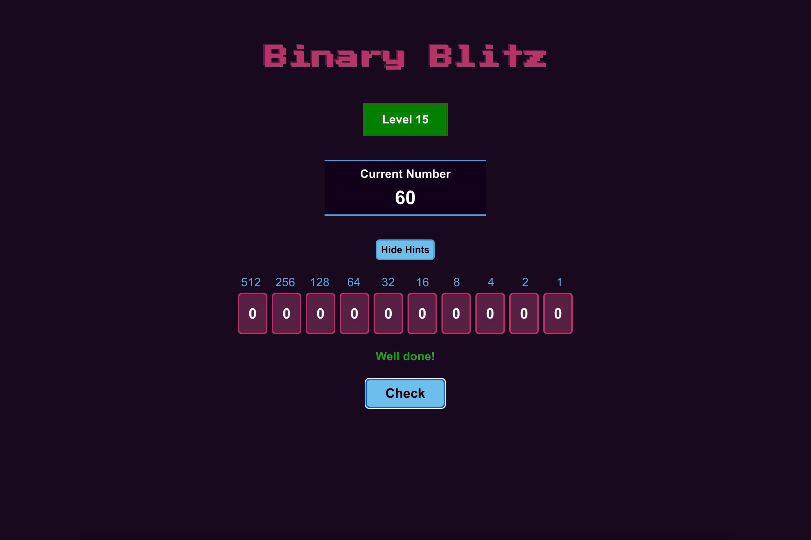

# Binary Blitz

Binary Blitz is a small game designed to help people learn how to convert binary values to decimals through repetition.

## Project Structure
- `public`
- `src`
    - `components` React component modules
    - `hooks` Reducer to control game state
    - `styled` [Styled components](https://styled-components.com/)
    - `styles` Global CSS styles
    - `util` Helper utility functions

## Running the project
In the project directory, you can run:

### `npm start`

Runs the app in the development mode.\
Open [http://localhost:3000](http://localhost:3000) to view it in the browser.
